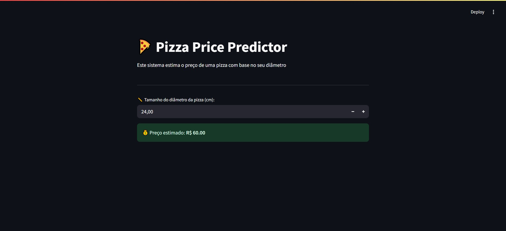

# Machine Learning Project: Pizza Price Predictor 🍕🔮

This project uses Machine Learning to train a model that predicts the price of a pizza based on its diameter, using linear regression and an interactive Streamlit interface.

<br>

## 🚀 How to Use 

1 - Clone the repository using the following command:
```bash
  git clone https://github.com/sarahzxwy/ml-pizza-price-predictor.git
   ```

2 - Navigate to the project folder:
```bash
  cd ml-pizza-price-predictor
   ```

3 - Install dependencies with Poetry:
```bash
  poetry install
   ```

4 - Activate the virtual environment:
```bash
  poetry shell
   ```

5 - Run the Streamlit app:
```bash
  streamlit run src/ml_pizza_price_predictor/app.py
   ```

<br>

## 🖥️ Application Overview

⚠️ *Note: the user interface is in Brazilian Portuguese.*

When you open the application, you'll see an input field where you can enter the pizza's diameter in centimeters or adjust the value using the "+" and "−" buttons. The system will then display the predicted price in Brazilian reais (R$).




<br>

## 💻 Technologies Used

The system was developed using the following technologies:

- **Python 3.12**: Programming language used for data processing and model training.
- **Poetry**: Dependency management and packaging tool for Python.
- **Pandas**: Library for data manipulation and analysis.
- **Matplotlib**: Library for data visualization.
- **Scikit-learn**: Machine Learning library used to build and train the linear regression model.
- **Streamlit**: Framework for building the interactive web app interface.
- **Jupyter Notebook**: Tool used for exploratory data analysis and model experimentation.

<br>

## 📂 Project Structure

<br>

**Folder Structure:**

```
ml-pizza-price-predictor/
├── assets/
│   └── images/
│       └── pizza-price-predictor-interface.jpg
├── dataset/
│   └── pizzas.csv
├── src/
│   └── ml_pizza_price_predictor/
│       ├── __init__.py
│       └── app.py
├── README.md
├── .gitignore
├── poetry.lock
├── pyproject.toml
└── tests.ipynb
```

<br>

**Code Structure:**

- `app.py`:  Loads pizza data, trains a linear regression model, and provides a user interface to predict pizza prices based on diameter input.
- `tests.ipybn`: Used for exploratory data analysis and initial testing of the linear regression model with pizza data.

<br>

## Author

 <a href="https://github.com/sarahzxwy">
        
        <br/>
        <sub><b>Sarah Alves Borges</b></sub>
</a>